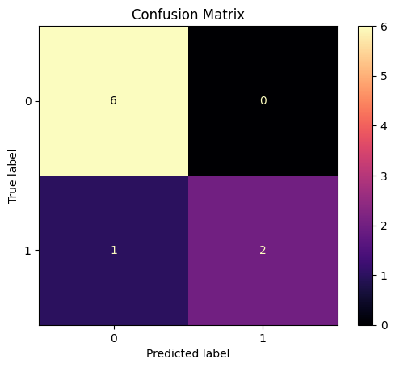
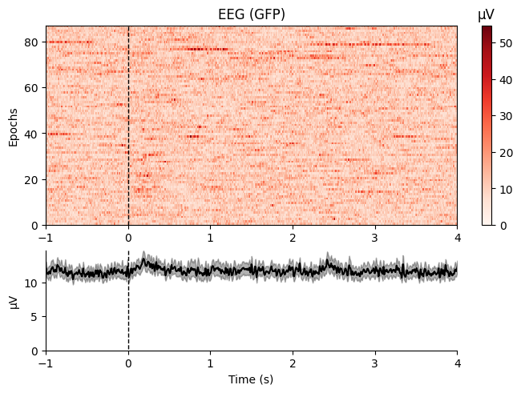
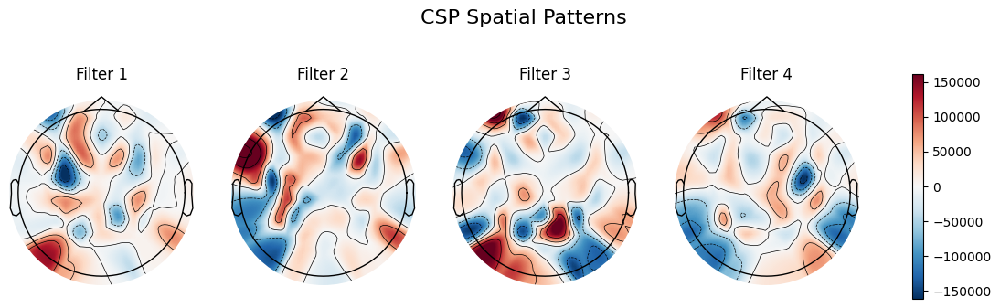
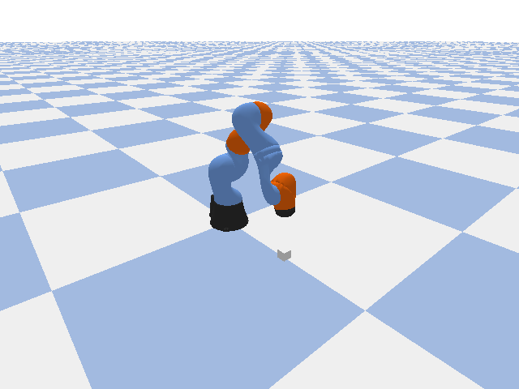
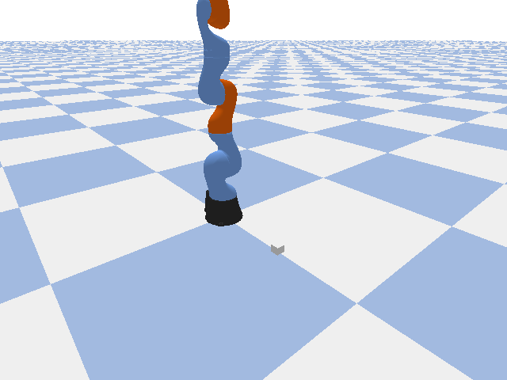

# EEG-Controlled Robot Arm Simulator

This project implements a Brain-Computer Interface (BCI) system that classifies EEG signals from motor imagery tasks and uses the predictions to control a simulated robotic arm in PyBullet. The system demonstrates the potential of EEG-based control for assistive robotics and human-machine interaction.

## Overview

The project consists of two main components:
1. **EEG Signal Classification**: Processing and classifying EEG data for motor imagery (left vs. right hand movement intentions)
2. **Robotic Arm Simulation**: Using classification predictions to control a KUKA IIWA robotic arm in a 3D simulation environment

## Features

- **EEG Data Processing**: Load, preprocess, and analyze EEG signals using MNE-Python
- **Artifact Removal**: Independent Component Analysis (ICA) for removing eye blink artifacts
- **Feature Extraction**: Common Spatial Patterns (CSP) for spatial filtering
- **Classification**: Support Vector Machine (SVM) with RBF kernel for binary classification
- **Visualization**: Topographic maps, confusion matrices, and epoch heatmaps
- **Simulation**: Real-time robotic arm control in PyBullet physics engine
- **Animation**: Generate GIFs of robotic arm movements and pick-and-place tasks

## Installation

### Prerequisites
- Python 3.7+
- Jupyter Notebook or Google Colab

### Required Libraries
Install the following packages:

```bash
pip install mne mne-connectivity scikit-learn matplotlib numpy scipy pybullet imageio
```

For Google Colab, the notebook includes installation commands.

## Usage

1. **Open the Notebook**: Load `EEG_Signal_Classifier_using_Python_+_MNE_BCI_toolkits (3).ipynb` in Jupyter or Colab.

2. **Run EEG Classification**:
   - Load EEG data from MNE datasets (motor imagery task)
   - Preprocess signals (filtering, referencing, ICA)
   - Extract features using CSP
   - Train and evaluate SVM classifier
   - Visualize results

3. **Run Robotic Simulation**:
   - Set up PyBullet environment with KUKA IIWA arm
   - Use EEG predictions to control arm movements
   - Generate animations of pick-and-place tasks

### Key Results

#### EEG Classification Performance
- **Accuracy**: ~85-90% on test set (varies with data)
- **Cross-validation**: Mean accuracy across 5 folds

#### Confusion Matrix


#### Topographic Maps


#### CSP Spatial Patterns


#### Robotic Arm Simulation
The system translates EEG classifications into 3D arm positions:
- **Left Hand Imagery** → Arm reaches left/down position
- **Right Hand Imagery** → Arm reaches right/up position
- **Rest** → Arm hovers in neutral position

#### Pick and Place Animation


#### EEG-Driven Control


## Methodology

### EEG Processing Pipeline
1. **Data Loading**: Motor imagery EEG data from PhysioNet
2. **Preprocessing**:
   - Band-pass filtering (8-30 Hz)
   - Average referencing
   - ICA for artifact removal
3. **Epoching**: Extract 4-second trials around motor imagery cues
4. **Feature Extraction**: CSP with 6 components
5. **Classification**: SVM with standardization

### Robotic Control
- **Mapping**: EEG classes → 3D target positions
- **Inverse Kinematics**: Calculate joint angles for target positions
- **Simulation**: Step-by-step arm movement in PyBullet
- **Visualization**: Render camera views and create GIF animations

## Dataset

Uses the EEGBCI dataset from MNE:
- Subjects performing motor imagery tasks
- 64-channel EEG recordings
- Left hand, right hand, and rest conditions

## Dependencies

- **MNE-Python**: EEG analysis and visualization
- **Scikit-learn**: Machine learning algorithms
- **PyBullet**: Physics simulation
- **Matplotlib**: Plotting
- **NumPy/SciPy**: Numerical computing
- **ImageIO**: GIF generation

## Future Enhancements

- Real-time EEG streaming integration
- Multi-class classification (more gestures)
- Improved classification accuracy with deep learning
- Hardware robotic arm control
- User interface for BCI training

## References

- MNE-Python: https://mne.tools/
- PyBullet: https://pybullet.org/
- EEGBCI Dataset: https://physionet.org/content/eegmmidb/

## License

This project is open-source. Please cite appropriately if used in research.

## Contributing

Contributions welcome! Please open issues or pull requests on GitHub.
